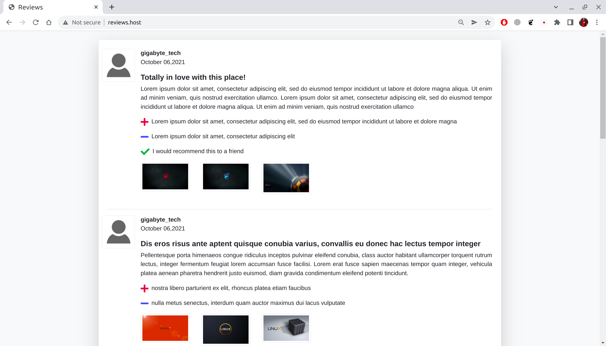
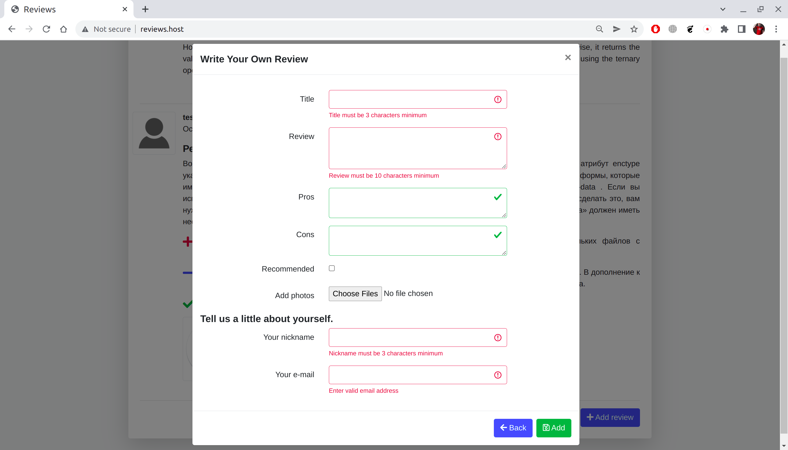
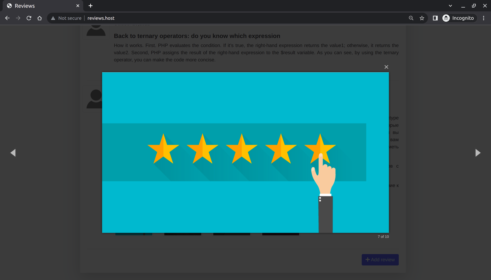

## About

A list of reviews with the ability to add a new one with images. Written in object oriented style with MVC structure of own development. Adding reviews implemented without reloading the page by using the JS technology Ajax. Used packages:

- nikic/fast-route - routing
- php-di/php-di - dependency injection container
- league/plates - a simple PHP template system
- gabordemooij/redbean - ORM for working with mySQL databases
- Validator - a simple class for data validation, own writed

Frontend used:
- Bootstrap 4.6.0
- jQuery 3.0.6

## How to configure
You only need to configure DB connection in config.php file, like:
```php
'mysql' =>  [
        'host'  =>  '127.0.0.1',
        'username'  =>  'root',
        'password'  =>  'password',
        'database'  =>  'reviews',
    ],
```
Also you can restore our database dump from file reviews.sql in this repository.

## How to use
List of all reviews:



Pop-up window of adding new review:



Image viewer:

